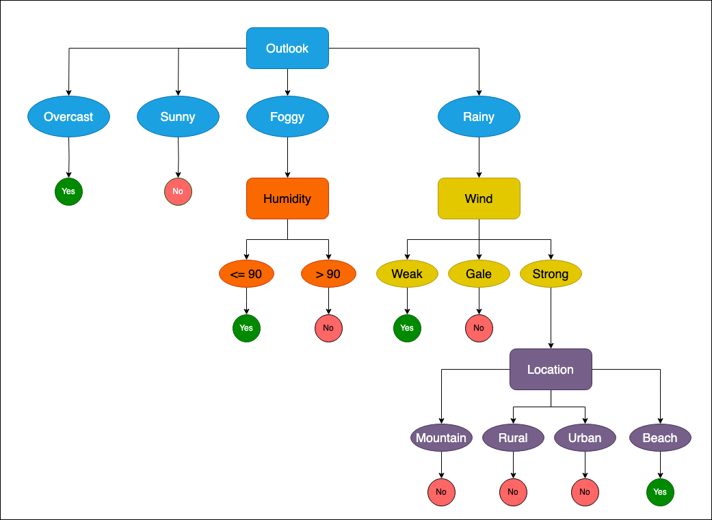

# Decision Tree with Rust

## Project Overview

As part of the lab course *Efficient AI with Rust* at RWTH Aachen University, I implemented a decision tree using the ID3 algorithm in Rust.

The dataset used contains various air condition features, with the target variable indicating whether we decide to play outside under those weather conditions.

## How to Run

To test the project, simply execute the following command:

```bash
cargo run -- ../my_csv.csv Play
```

- The first argument is the path to the training dataset (`my_csv.csv`).
- The second argument specifies the name of the target column (`Play`).

In the file `decision_tree/src/main.rs`, you can find a hardcoded test instance. Feel free to modify the feature values to observe how predictions change.

## Trained Tree

The decision tree was trained on the dataset found in `my_csv.csv`. The resulting tree structure is visualized below:

<p float="left">
  
</p>
